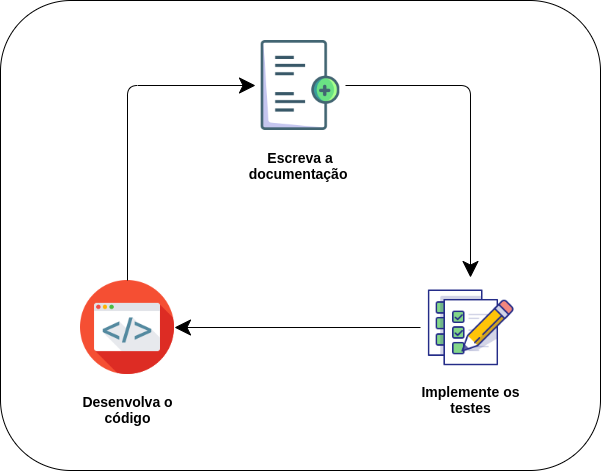

# DocsBuilder

Projeto criado como exercício para a implantação de um ambiente de desenvolvimento saudável em python.

## Pré-requisitos

Este projeto usa exclusivamente o gerenciador de pacotes `Poetry`, instalá-lo é altamenterecomendado.

## Instalação

Com o Poetry instalado, basta executar o código:

```bash
poetry install
```

## Conceitos Gerais

Este projeto tem como objetivo ser um tutorial para implantar e configurar um ambiente desenvolvimento em Python que segue as diretrizes do Desenvolvimento Orientado a Testes (TDD), além de fazer uso de ferramentas para a geração automática de Documentação e formatação automática e obrigatória do código desenvolvido antes de qualquer atualização no repositório.



### Execução dos Git Hooks

Após a clonagem do repositório, é necessário configurar os comandos que vão ser executados antes de cada commit. O módulo `pre-commit` é responsável pela execução dos Hooks. Para instalar o hooks no projeto basta apenas executar o comando:

```bash
pre-commit install
```

## Licensas 

Nenhuma até o momento.
